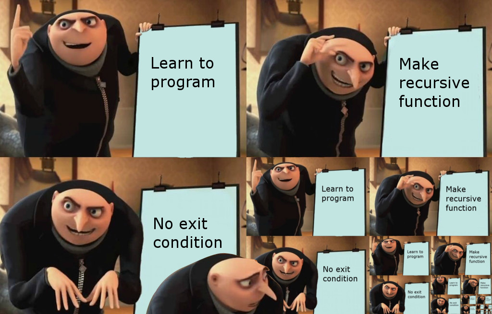

---
# You can also start simply with 'default'
theme: seriph
# random image from a curated Unsplash collection by Anthony
# like them? see https://unsplash.com/collections/94734566/slidev
# some information about your slides (markdown enabled)
title: Slidev Slides
info: |
  ## Slidev
  Presentation slides for developers.

  Learn more at [Sli.dev](https://sli.dev)
# apply unocss classes to the current slide
class: text-center
# https://sli.dev/features/drawing
drawings:
  persist: false
# slide transition: https://sli.dev/guide/animations.html#slide-transitions
transition: slide-left
# enable MDC Syntax: https://sli.dev/features/mdc
mdc: true
# take snapshot for each slide in the overview
overviewSnapshots: true
---

# Why it’s time to npm uninstall PowerPoint

<div class="abs-br m-6 flex gap-2">
  <button @click="$slidev.nav.openInEditor()" title="Open in Editor" class="text-xl slidev-icon-btn opacity-50 !border-none !hover:text-white">
    <carbon:edit />
  </button>
  <a href="https://github.com/yedidyar/slidev-slides" target="_blank" alt="GitHub" title="Open in GitHub"
    class="text-xl slidev-icon-btn opacity-50 !border-none !hover:text-white">
    <carbon-logo-github />
  </a>
</div>

<!--
The last comment block of each slide will be treated as slide notes. It will be visible and editable in Presenter Mode along with the slide. [Read more in the docs](https://sli.dev/guide/syntax.html#notes)
-->

---
layout: center
---



---
layout: image-right
image: https://media2.giphy.com/media/v1.Y2lkPTc5MGI3NjExYWlsOXBpcm9vdGw1aXdnMzRzeDQ2d3NkZXdhd3pjdnRrZHltdXpwNyZlcD12MV9pbnRlcm5hbF9naWZfYnlfaWQmY3Q9Zw/wzJ67MJMk6UMM/giphy.webp
---

## 🚀 Introduction

<br/>

### About Me

- **Name:** Yedidya Rashi
- **Role:** DevEx Developer at Next Insurance
- **Passion:** Web development & open-source projects
- **Free Time:** Computer science, economics, gaming, and wasting my time on TikTok

---
transition: fade-out
---

# What is Slidev?

<li v-click>📝 <strong>Text-based</strong> - focus on the content with Markdown, and then style them later</li>
<li v-click>🎨 <strong>Themable</strong> - themes can be shared and re-used as npm packages</li>
<li v-click>🧑‍💻 <strong>Developer Friendly</strong> - code highlighting, live coding with autocompletion</li>
<li v-click>🤹 <strong>Interactive</strong> - embed Vue components to enhance your expressions</li>
<li v-click>📤 <strong>Portable</strong> - export to PDF, PPTX, PNGs, or even a hostable SPA</li>
<li v-click>🛠 <strong>Hackable</strong> - virtually anything that's possible on a webpage is possible in Slidev</li>

  <br>
  <br>

<div v-click>
  <a href="https://sli.dev" class="btn">Learn More</a>
</div>

<!--
You can have `style` tag in markdown to override the style for the current page.
Learn more: https://sli.dev/features/slide-scope-style
-->

<style>
h1 {
  background-color: #2B90B6;
  background-image: linear-gradient(45deg, #4EC5D4 10%, #146b8c 20%);
  background-size: 100%;
  -webkit-background-clip: text;
  -moz-background-clip: text;
  -webkit-text-fill-color: transparent;
  -moz-text-fill-color: transparent;
}
</style>

<!--
Here is another comment.
-->

---

# Code

Use code snippets and get the highlighting directly, and even types hover!

```ts {all|5|7|7-8|10|all} twoslash
// TwoSlash enables TypeScript hover information
// and errors in markdown code blocks
// More at https://shiki.style/packages/twoslash

import { computed, ref } from "vue";

const count = ref(0);
const doubled = computed(() => count.value * 2);

doubled.value = 2;
```

<arrow v-click="[4, 5]" x1="360" y1="270" x2="205" y2="310" color="#953" width="2" arrowSize="1" />

<!-- Footer -->

[Learn more](https://sli.dev/features/line-highlighting)

<!-- Inline style -->
<style>
.footnotes-sep {
  @apply mt-5 opacity-10;
}
.footnotes {
  @apply text-sm opacity-75;
}
.footnote-backref {
  display: none;
}
</style>

<!--
Notes can also sync with clicks

[click] This will be highlighted after the first click

[click] Highlighted with `count = ref(0)`

[click:3] Last click (skip two clicks)
-->

---
level: 2
---

# Shiki Magic Move

Powered by [shiki-magic-move](https://shiki-magic-move.netlify.app/), Slidev supports animations across multiple code snippets.

Add multiple code blocks and wrap them with <code>````md magic-move</code> (four backticks) to enable the magic move. For example:

````md magic-move {lines: true}
```ts {*|4-6|8-10|*}
// Step 1: Set Up a Basic Server
import http from "http";

const server = http.createServer((req, res) => {
  res.end("Welcome to the Node.js Israel open stage meetup!\n");
});

server.listen(3000, () =>
  console.log("Server running at http://localhost:3000"),
);
```

```ts
// Step 2: Add Routing Logic
const server = http.createServer((req, res) => {
  if (req.url === "/")
    res.end("Welcome to the Node.js Israel open stage meetup!");
  else if (req.url === "/about")
    res.end("Learn more about the Node.js Israel community");
  else res.end("404 Page Not Found");
});
```

```ts
// Step 3: Introduce Async File Read
import fs from "fs/promises";

const server = http.createServer(async (req, res) => {
  if (req.url === "/speakers") {
    try {
      const data = await fs.readFile("speakers.txt", "utf8");
      res.end(`meetup speakers:\n${data}`);
    } catch {
      res.end("speakers file not found");
    }
  } else res.end("404 Page Not Found");
});
```
````

---

# Components

<div grid="~ cols-2 gap-4">
<div>

You can use Vue components directly inside your slides.

We have provided a few built-in components like `<Tweet/>` and `<Youtube/>` that you can use directly. And adding your custom components is also super easy.

```html
<Counter :count="10" />
```

<!-- ./components/Counter.vue -->
<Counter :count="10" m="t-4" />

Check out [the guides](https://sli.dev/builtin/components.html) for more.

</div>
<div>

```html
<Tweet id="1390115482657726468" />
```

<Tweet id="1390115482657726468" scale="0.65" />

</div>
</div>

<!--
Presenter note with **bold**, *italic*, and ~~striked~~ text.

Also, HTML elements are valid:
<div class="flex w-full">
  <span style="flex-grow: 1;">Left content</span>
  <span>Right content</span>
</div>
-->

---

# Motions

Motion animations are powered by [@vueuse/motion](https://motion.vueuse.org/), triggered by `v-motion` directive.

```html
<div
  v-motion
  :initial="{ x: -80 }"
  :enter="{ x: 0 }"
  :click-3="{ x: 80 }"
  :leave="{ x: 1000 }"
>
  Slidev
</div>
```

<div class="w-60 relative">
  <div class="relative w-40 h-40">
    
    
    
  </div>

  <div
    class="text-5xl absolute top-14 left-40 text-[#2B90B6] -z-1"
    v-motion
    :initial="{ x: -80, opacity: 0}"
    :enter="{ x: 0, opacity: 1, transition: { delay: 2000, duration: 1000 } }">
    Slidev
  </div>
</div>

<!-- vue script setup scripts can be directly used in markdown, and will only affects current page -->
<script setup lang="ts">
const final = {
  x: 0,
  y: 0,
  rotate: 0,
  scale: 1,
  transition: {
    type: 'spring',
    damping: 10,
    stiffness: 20,
    mass: 2
  }
}
</script>

<div
  v-motion
  :initial="{ x:35, y: 30, opacity: 0}"
  :enter="{ y: 0, opacity: 1, transition: { delay: 3500 } }">

[Learn more](https://sli.dev/guide/animations.html#motion)

</div>

---

# Diagrams

You can create diagrams / graphs from textual descriptions, directly in your Markdown.

<div class="grid grid-cols-4 gap-5 pt-4 -mb-6">


</div>

Learn more: [Mermaid Diagrams](https://sli.dev/features/mermaid) and [PlantUML Diagrams](https://sli.dev/features/plantuml)

---

# Monaco Editor

Slidev provides built-in Monaco Editor support.

Add `{monaco}` to the code block to turn it into an editor:

```ts {monaco}
import { ref } from "vue";
import { emptyArray } from "./external";

const arr = ref(emptyArray(10));
```

Use `{monaco-run}` to create an editor that can execute the code directly in the slide:

<!-- prettier-ignore -->
```ts {monaco-run}
import { version } from "vue";
import { emptyArray, sayHello } from "./external";

sayHello()
console.log(`vue ${version}`)
console.log(emptyArray<number>(10).reduce(fib => [...fib, fib.at(-1)! + fib.at(-2)!], [1, 1]))
```

---

# Learn More

<li>💅 <strong>Stylish</strong> - Utilizes UnoCSS for on-demand utility-first CSS, facilitating effortless styling of slides.</li>
<li>🧩 <strong>Interactive</strong> - Allows embedding of Vue components directly into slides, enhancing interactivity and expressiveness.</li>
<li>🗣️ <strong>Presenter Mode</strong> - Offers a presenter mode that can be accessed via a separate window or device, providing speaker notes and slide previews.</li>
<li>✏️ <strong>Drawing and Annotations</strong> - Enables drawing and annotating directly on slides to emphasize key points during presentations.</li>
<li>📐 <strong>LaTeX Support</strong> - Built-in support for LaTeX allows for the inclusion of complex mathematical equations.</li>
<li>🖼️ <strong>Icons</strong> - Provides access to a vast collection of icons from various icon sets, which can be used directly in Markdown.</li>
<li>🎥 <strong>Recording</strong> - Includes built-in recording and camera view functionalities, allowing you to record presentations with ease.</li>
<li>📥 <strong>Code Snippet Importing</strong> - Import code snippets from existing files into your slides, facilitating the inclusion of external code examples.</li>

<li>🎨 <strong>Prettier Plugin</strong> - Use the Prettier plugin to format your slides, ensuring consistent and clean code formatting.</li>

<li>🔍 <strong>Zoom Slides</strong> - Zoom the content of a slide to a specific scale, highlighting important details during presentations.</li>

<br>
<br>

<div class="text-center">
  <a href="https://sli.dev">Documentation</a> · <a href="https://github.com/slidevjs/slidev">GitHub</a> · <a href="https://sli.dev/resources/showcases">Showcases</a>

</div>

<div class="text-center">
    <PoweredBySlidev class="mt-10" />
</div>

<style>
  li {
    font-size: 0.85rem;
  }
</style>

---
layout: center
class: text-center
---

# Thank You! 🙏

---
layout: center
class: text-center
---

# My Socials 😄

<div class="flex justify-center">
  
</div>

Yedidya Rashi - Developer Experience Developer at Next Insurance

<div class="flex justify-center gap-4 mt-4">
  <div class="flex items-center gap-2">
    <a href="https://github.com/yedidyar" target="_blank" class="!border-none !hover:text-blue-500"> <carbon-logo-github class="text-3xl"/>  </a>
     @yedidyar
  </div>
  <div class="flex items-center gap-2">
    <a href="https://x.com/yedidyaRashi" target="_blank" class="!border-none !hover:text-blue-500"> <carbon-logo-twitter class="text-3xl"/>  </a>
    @yedidyaRashi
  </div>
  <div class="flex items-center gap-2">
    <a href="https://www.linkedin.com/in/yedidya-rashi/" target="_blank" class="!border-none !hover:text-blue-500"> <carbon-logo-linkedin class="text-3xl"/>  </a>
    @Yedidya Rashi
  </div>

</div>
